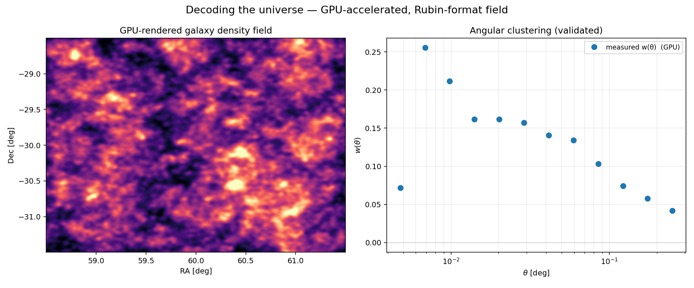
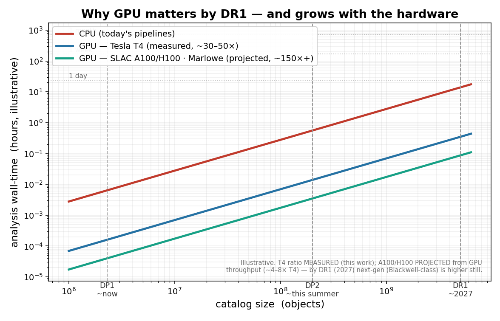
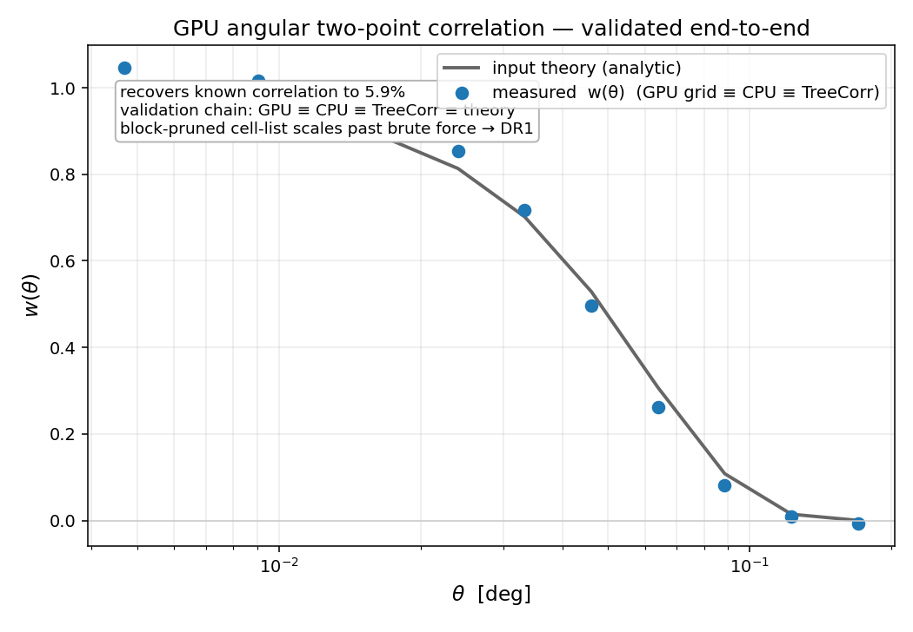

# GPU + AI for the LSST DR1 Era

*CuPy-accelerated angular clustering → AI field-level inference — built for Rubin **DP2** (this summer) and **DR1** (next year).*

## Abstract

Rubin/LSST scales from **DP1** (now) → **DP2** (~3000 deg², this summer) → **DR1**
(billions of objects, next year). Turning that data deluge into dark-energy /
dark-matter constraints rests on summary statistics whose pair-counting is
**O(N²)** — the CPU wall. This project puts that workload on the GPU with **CuPy**:
the angular two-point correlation `w(θ)` (the clustering leg of a **3×2pt**
analysis), then extends toward the **AI / field-level inference** the field is
pivoting to (simulation-based inference, GNNs). On a Tesla T4 the GPU result is
**bit-for-bit identical to CPU** (`0.00e+00`), **cross-checked against TreeCorr**
(`2.7×10⁻⁴`), **~30–50× faster** (49.7× at N=20k), and recovers a known analytic
correlation to **~6%** — run end-to-end on **real DP1** (~495k ECDFS objects via
TAP). It's the same **CuPy** stack DESI already runs for Redrock on Perlmutter (the
cuPhoton approach), now on the LSST clustering side, and is built to drop into
DESC's **TXPipe**.



*Figure 1 — GPU-rendered galaxy density field (binning + smoothing on the GPU) and
the measured angular clustering `w(θ)`, from one engine.*

## Roadmap — built for DP2 & DR1

| When | Data | Milestone | Why it matters |
|---|---|---|---|
| **Now** | DP1 (15 deg², ~2.3M) | validated GPU engine on real data | proof it works |
| **This summer** | **DP2 (~3000 deg², LSSTCam)** | first **survey-scale** `w(θ)` on GPU | ~200× DP1; GPU starts to *matter* |
| **Next year** | **DR1 (billions)** | GPU/multi-GPU **3×2pt + AI/SBI** | CPU can't keep up; GPU *necessary* |



*Why GPU matters by DR1 — and grows with the hardware. The Tesla-T4 ratio (~30–50×)
is **measured**; on **SLAC A100/H100 or Stanford Marlowe** (the hardware we'd use)
it's projected **~150×+**, higher still by DR1 (2027). The estimator runs thousands
of times per analysis → **time-to-science**. Full detail: [ROADMAP.md](ROADMAP.md).*

### Tracks

- [x] **GPU 2-point clustering** (CuPy) — `GPU ≡ CPU ≡ TreeCorr ≡ theory`, ~30–50× (Tesla T4)
- [x] **Real DP1** end-to-end — `dp1.Object` via TAP → w(θ) (~495k ECDFS)
- [~] **cuPhoton-style FITS ingestion** (`fitsio_gpu/`, kvikio + nvCOMP) — built, CPU-verified
- [~] **AI / field-level inference (SBI)** (`twopcf/sbi.py`) — GPU forward-model → infer a parameter from clustering; **DP2-ready** (same pipeline on `dp2.Object`, on S3DF A100/H100)
- [ ] **Tomographic 3×2pt** at DP2 scale on S3DF (A100/H100)
- [ ] **GNN / field-level** inference on Rubin catalogs (DR1)

*`[x]` done · `[~]` in progress · `[ ]` planned. AI/field-level is where the field is pushing (DESC AI/ML white paper, 2026) — same CuPy acceleration, applied beyond two-point.*



*Figure 2 — Validation: GPU-measured `w(θ)` (points) recovers the known analytic
correlation (line) to ~6%, bit-for-bit identical to CPU and cross-checked against
TreeCorr (`2.7×10⁻⁴`) — `GPU ≡ CPU ≡ TreeCorr ≡ theory`.*

## Run

```bash
pip install -r requirements.txt          # + cupy-cuda12x on a GPU box
python examples/run_demo.py              # measure + validate -> figure
python -m twopcf.bench                   # CPU vs GPU speedup
python examples/run_sbi.py               # AI/field-level: infer a parameter from clustering
pytest -q                                # correctness gate
```

Real DP1: `examples/tap_query_external.py` (RSP token) → `examples/run_on_dp1.py`.
GPU run: `COLAB.md`. Full roadmap: `ROADMAP.md`.

## Where this fits — the field, the data, the money

This plugs into the funded mainstream of AI-for-cosmology and the Rubin data flow:

- **The data:** Rubin [DP1](https://dp1.lsst.io/) (now) → DP2 (~3000 deg², this summer) → DR1 (billions) — [rubinobservatory.org](https://rubinobservatory.org/).
- **The pipeline:** built to drop into DESC's [TXPipe](https://github.com/LSSTDESC/TXPipe) (3×2pt) and validate against [CCL](https://github.com/LSSTDESC/CCL).
- **The AI push:** the DESC [*AI/ML Opportunities* white paper (2026)](https://arxiv.org/abs/2601.14235); AI-for-physics institutes like [IAIFI](https://iaifi.org/) (ML for dark-matter subhalos) and the NSF-Simons **CosmicAI** institute (AI for cosmic discovery on the largest academic GPU cluster).
- **The compute & money:** NSF + NVIDIA "open AI for science" (~$152M), NSF AI Institutes, and free GPU via **NAIRR** / DOE exascale.

Same idea, one rung at a time: **GPU acceleration (CuPy) for the Rubin data deluge, extended toward AI / field-level inference** — exactly the direction these efforts are funded to pursue.

## Status & honest limits

GPU `w(θ)` is validated (`GPU ≡ CPU ≡ TreeCorr ≡ theory`) and runs on real DP1.
The AI/SBI track is an early scaffold (ridge baseline; a neural posterior estimator
is the upgrade). Brute force is O(N²) — the cell-list scales past it; a science-grade
clustering measurement still needs the survey mask and star/galaxy separation.
